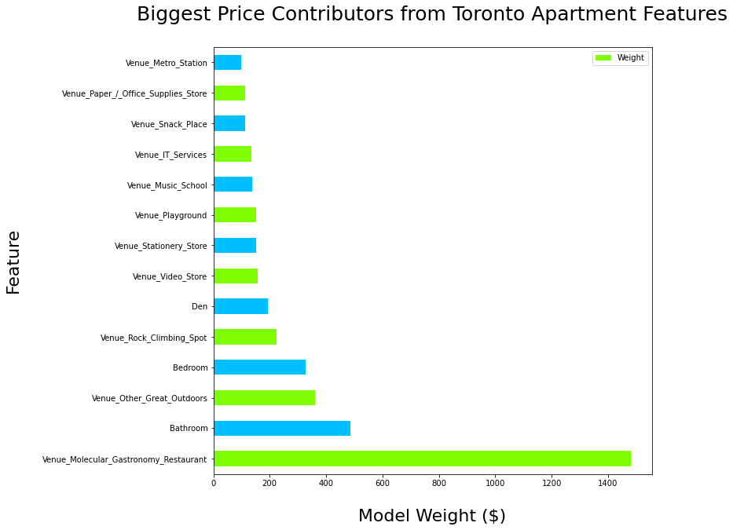

# Using Nearby Businesses to Predict Toronto Apartment Rental Prices 
### by Seshagiri Sriram

## Table of Contents
1. [Introduction](#1---introduction)
2. [Data Description](#2---data-description)
3. [Methodology](#3---methodology)
4. [Results](#4---results)
5. [Discussion](#5---discussion)
6. [Conclusion](#6---conclusion)
7. [References](#7---references)

## 1 - Introduction
Can we predict a Toronto apartment's rental price by knowing the businesses around it? This capstone is an exploration to see what effect businesses have on nearby apartment prices, and to try and determine the trends that lead to more expensive or desirable living space. If we know that certain businesses impact the price of an apartment when they open nearby, we can locate businesses that are more valuable to people. It can help land developers and business owners better forecast how new businesses can impact apartment rental prices in neighborhoods.

[To Top](#table-of-contents)

## 2 - Data Description
The data used will be a combination of datasets, and data from API calls. The primary dataset is compromised of Toronto apartment rental prices for 2018. The dataset contains the price, address, latitude, longitude, and rooms of 1124 apartments for rent in the Toronto area. This dataset is publicly available on Kaggle[1](#7---references). The Latitude, Longitude values in the dataset will be used with the Foursquare API to find the businesses nearby each apartment.

[To Top](#table-of-contents)

## 3 - Methodology 
Methodology section which represents the main component of the report where you discuss and describe any exploratory data analysis that you did, any inferential statistical testing that you performed, and what machine learnings were used and why.

### 3.1 - Data Cleansing
Several steps were taken to prepare the kaggle dataset for the project. The apartment prices were initially string values prefixed by a dollar sign, so they were converted to float values. Since main addrss information by itself, is not interesting, the first three letters of the apartment postal code were extracted using using a regex, and the rest of the address information was dropped. 

*Figure 1. Image of the uncleaned Kaggle dataset in a pandas dataframe*

Apartment could now be easily grouped based on postal code area they reside in. Could it done using lat/long? In theory yes. However, there was a lot of effort in settng up fencing information (ie. the neighbourhood boundaries) and I decided not to go with that approach.  Next the apartments were mapped using their latitude/longitude so I could identify outliers. The data set contained several apartments in Montreal, Calgary, Winnipeg and other Ontario cities that should not have been in the Toronto dataset. The original dataset was cleansed to get a "clean" dataset listing Toronto neighborhoods for each postal code from another  project[2](#7---references). 

*Figure 2. Stray Apartments in the Dataset*

Working with Raw LAT/LONG is less useful on a number of fronts
- Effort and complexity to implement
- Without maps, it will be less meaningul. 

I felt a better approach would to to derive a new feature from them called "Distance to Downtown Toronto" by calculating the euclidean distance from City Hall. Then I normalized it with a Min/Max Scaler to shift the values to all be between zero and one. That way all of our features would be positive, and most of our features are in the zero-to-one range for any models that are sensitive to scaling. 

*Figure 3. Toronto Venue Data*

Next I used FourSquare to get the **venues** (FourSquare's term for businesses, amenities, parks, etc) within one kilometer of each apartment. I converted these venues into a one-hot encoded matrix, then aggregated all the rows related to one apartment, and merged it with the prepared kaggle dataframe. 

*Figure 4. Apartments data merged with the Venue Matrix*

### 3.2 - Exploratory Analysis

The bulk of the exploratory analysis was focused on the kaggle dataset. 

*Figure 5. Histogram of Toronto Apartment Prices*

Looking at the apartment prices distribution, we see it forms a nice bell curve centered around a $2500 rental price, ranging from around $500 to $5000. It is skewed right, which is to be expected as the apartment prices have a hard limit before $0 (A $0 Apartment would really be great :-), but can go up very high, leading to the skew towards right. 

*Figure 6.1 Histogram of Toronto Apartment Proximity to Downtown. Figure 6.2 Histogram of Toronto Apartment Rooms*

We can see from figure 6.1 that the majority of our apartments are in downtown, and are very close to city hall. From Figure 6.2 we see that most of our apartment are single bedroom, single bathroom, and without a den. That makes sense for most downtown apartments in most cities around the world. I plotted the Apartment price vs Proximity to downtown. 

*Figure 7 Toronto Apartment Price vs. Downtown Proximity*

Looking at the plot, it was clear that any model we create is going to have trouble identifying prices when a house is close to downtown. I then tried to plot on appartment type(feature). Ths included: bedrooms, bathrooms and dens to identify correlations and trends without introducing our additional venue data. The goal of this excercise was to see if those characteristics can help us identify different price brackets close to downtown. 

*Figure 8. Single Bedroom Apartments: Price vs Proximity to Downtown*

*Figure 9. Single Bathroom Apartments: Price vs Proximity to Downtown*

*Figure 10. Apartments without a Den: Price vs Proximity to Downtown*

We see from these three figures that the prices look somewhat linear right of 0.4 scaled distance units, however everything from 0 - 0.4 units is nowhere near a linear trend. Theefore we need to add the venue data to help us to get better predictions.

### 3.3 Use of Machine Learning
An array of regression algorithms were used to benchmark the performance on the dataset. The models used were: 

- Linear Regression
= Ridge Regression
- Lasso Regression
- Elastic Net
- SGD
- Bayesian Regression
- Logistical Regression
- SVM (SVR)

Each model was evaluated by taking the mean squared error of the model price prediction against the actual rental price.

*Figure 11. Benchmarking Machine Learning Algorithms*

The elastic net performs the best out-of-the-box, so that is the model we will select. It has a root mean square error (RMSE) of $436 and a R-squared correlation of 60% on the test set. 

*Figure 12. Benchmarking Machine Learning Algorithms*

Next I tuned the model hyperparameters to make the model the best it can be, evaluating its improvement with the test set. The process is listed below: 

- Start by doing a random search of the parameters to find a good guess for each
- use grid search to find the best parameters starting with those guesses. 

After hyperparameter tuning we get the test set RMSE down to $318, with an accuracy of 85%.  Finally I tested the tuned model on the validation set and got 74% accuracy with a MSE of $339.

[To Top](#table-of-contents)

## 4 - Results

The above show that we can use machine learning models to predict Toronto apartment prices using the nearby venues and apartment characteristics. From our machine learning model, we can look at the most important features to understand the key factors that drive our model. The highest weighted features (**key contributors**) and the lowest weighted features (**key detractors**) will be extracted from our model.

*Figure 15. Key Contributors to Toronto Apartment Prices*

After seeing our key contributors, we see that apartments with more Dens, Bathrooms, and Bedrooms have higher prices. TWe also see that most of the contributors are related to outdoors activities, like parks, golf courses, playgrounds, outdoor scenery, and rock climbing. Other notable businesses are wine stores and molecular gastronomy restuarants.

*Figure 16. Key Detractors to Toronto Apartment Prices*

Based on the biggest detractors, we see that apartments far from downtown have the lowest prices. Some of the businesses that detract from the price are tattoo parlors, toy stores/arcades, Pakistani restuarants, and hookah bars. Being close to a doctor's office or being close to downton drives prices up. Business that drive prices up include Tennis courts and Yogurt/pastry shops.

[To Top](#table-of-contents)

## 5 - Discussion 

### Recommendations 
Some of our recommendations are: 

#### For Apartment Building developers
- Develop apartments in neighborhoods with lots of parks, nature, outdoor activities, and as close to downtown as possible. 
- Such units will have the highest price when these conditions are met and they are not surrounded by tattoo parlors, hookah bars and certain ethnic restaurants
- Such units will have the highest price when these conditions are met and they have wine parlors, new style food restaurants (molecular gastronomy), and are close to a doctor's office. 

#### For Apartment owners
- Prices can be driven higher by investing in more green space, parks, playgrounds, and outdoor activities in the neighborhood.

#### For Tenants
- Price will be lowest if you live further from downtown. 
- Look for apartments close to high schools, or without green space nearby, you can find apartments with a similar number of rooms for a lower rental price.

### Other notes 
- We would need significantly more apartment data to generalize this model to other cities. 
- The Toronto apartment prices will differ significantly from the apartment prices of other cities due to demand, population and other factors.

[To Top](#table-of-contents)

## 6 - Conclusion 
We used Toronto apartment location, rooms, and nearby businesses to train an elastic net regression model to predict the monthly rental price of an apartment. The model can predict the price on average within $336 CAD on our validation set, with 74% accuracy. 

We found out that apartments close to downtown, near high schools, and with outdoor activities like green space, scenery, and parks are higher value apartments for the same number of rooms. This allowed us to make recomendations to tenants, apartment complex owners, and apartment building developers to evaluate apartment value, and possibly increase it by investing in nearby ammenities, and businesses operating in the neighborhood.

[To Top](#table-of-contents)

## 7 - References

1. Toronto apartment prices dataset: *https://www.kaggle.com/rajacsp/toronto-apartment-price*

2. Toronto borough, and neighborhood for each postal code: [Clustering and Segmenting Toronto Neighborhoods.ipynb](./Clustering%20and%20Segmenting%20Toronto%20Neighborhoods.ipynb)

[To Top](#table-of-contents)
