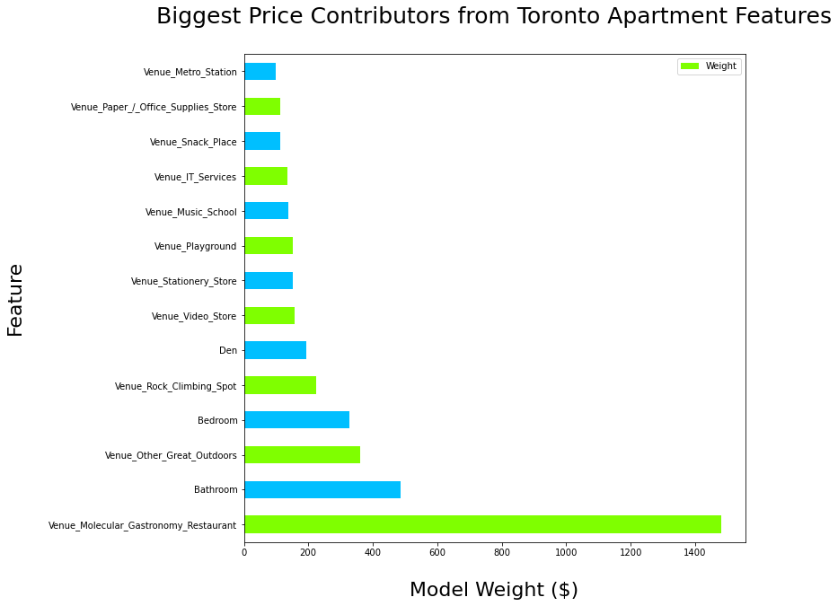
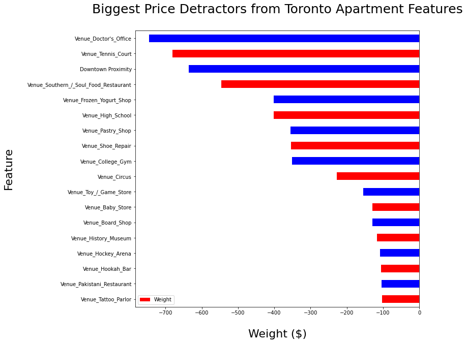
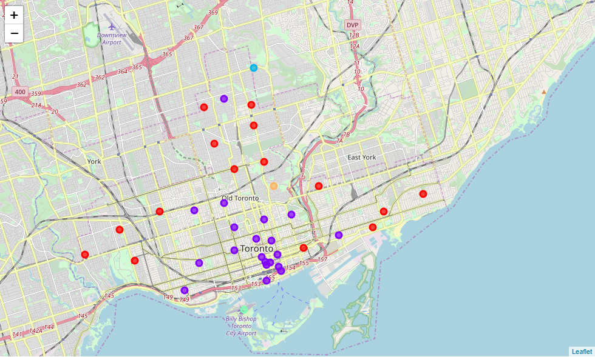

# Coursera-Capstone
### by Seshagiri Sriram 

This is a final capstone project for a data science coursera course.  It is the ninth and final course before obtaining: a *Data Science Professional Certification from IBM & Coursera*. 

## The Capstone Report:
- [Capstone Report](ProjectReport.md)

## The Capstone Project:
- [I. Capstone Data Collection & Cleaning](Capstone%20Project%20Part%20I.ipynb)
- [II. Capstone Gathering Nearby Businesses and Data Exploration](Capstone%20Project%20Part%20II.ipynb)
- [III. Capstone Machine Learning](Capstone%20Project%20Part%20III.ipynb)

## The Capstone Presentation
- [Capstone Summary Presentation](./presentation/Capstone_Presentation.pdf)

### Problem Summary:
We would like to predict an apartment's rental price in Toronto by knowing the businesses around it. Specifically, we would like to explore what effect businesses have on nearby apartment prices, and to try and determine the trends that lead to more expensive or desirable living space. If we know that certain businesses impact the price of an apartment when they open nearby, we can locate businesses that are more valuable to people. It can help land developers and business owners better forecast how new businesses can impact apartment rental prices in neighborhoods.

###

## This notebook contains another project using the FourSquare API:

- [Clustering and Segmenting Toronto Neighborhoods](./Clustering%20and%20Segmenting%20Toronto%20Neighborhoods.ipynb)

### K-Means Clustering Toronto Neighbourhoods based on their Most Common Restaurant and Store Types

